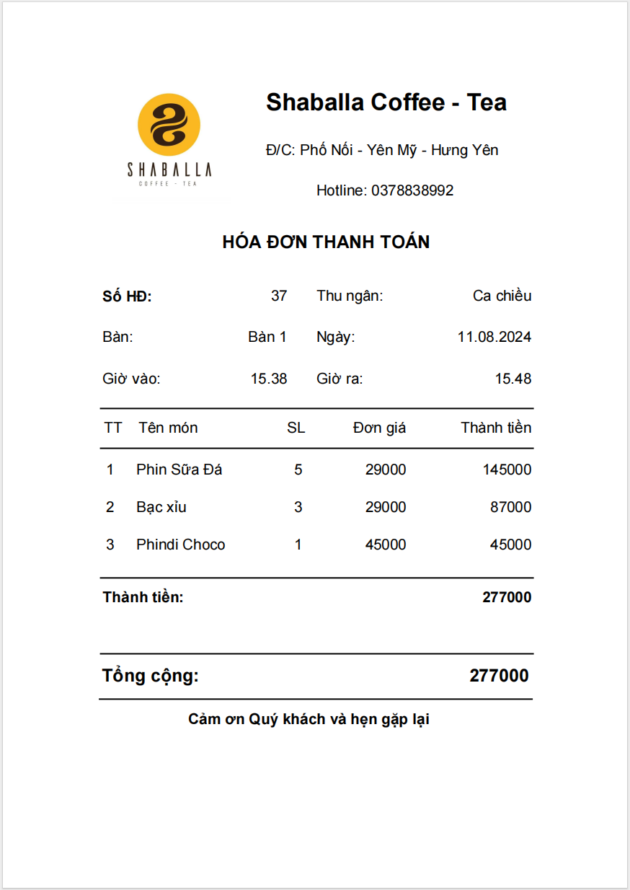

# Coffee Shop Management System
## Overview
This Coffee Shop Management System is designed to help cafe owners and staff efficiently manage daily operations. The system includes features for managing orders, menu, area, bill, warehouse, supplier, statiscal, shift, activity log, employees, customer information, and assign usage rights to each type of account. It aims to streamline the workflow, enhance customer service, and improve overall business efficiency.

## Features
1. Order Management
- Place new orders with ease.
- Track ongoing and completed orders.
- Generate receipts for customers.

2. Warehouse Management
- Keep track of stock levels for ingredients and supplies.
- Import and export goods in warehouse.

3. Menu management
- Manage categories and products, can add or export to excel file.

4. Area management
- Manage tables and areas.

5. Bill management
- View invoices and details over time, export to excel file or reprint invoices.

6. Employee Management
- Add, update, and delete employee information.
- Assign roles and permissions to staff members.

7. Customer Management
- Maintain a customer database with contact details.

8. Supplier Management:
- Maintain a supplier database with contact details.

9. Shift Management:
- Assign work shifts to each employee, can be assigned using excel file.

10. Activity Log
- Save important operational information.
- View logs by activity, employee, data exported to excel file.

11. Statistical
- Generate sales reports, revenue reports, inventory reports, and employee performance reports.
- Export reports to excel file.

## Technology
- Windows Form with c# (for frontend and backend).
- SQL Server (for database).

## illustration

 Login |  Print Invoice |
|-|-|

 Sell |
|-|

 Menu |  Area |
|-|-|

 Customer Information |  Bill |
|-|-|

  Suppier |  Import Products |
|-|-|

 Export Products |  Items |
|-|-|

 Warehouse |  Statistical |
|-|-|

 Statistical |  Statistical |
|-|-|

 Shift |  Shift |
|-|-|

 Activity Log |  Users |
|-|-|

 Decentralizaion |
|-|

# Video
https://www.youtube.com/watch?v=-X5ryMT-vg4&t=43s

## Contact
For any inquiries or support, please contact nguyendatkak@gmail.com.
